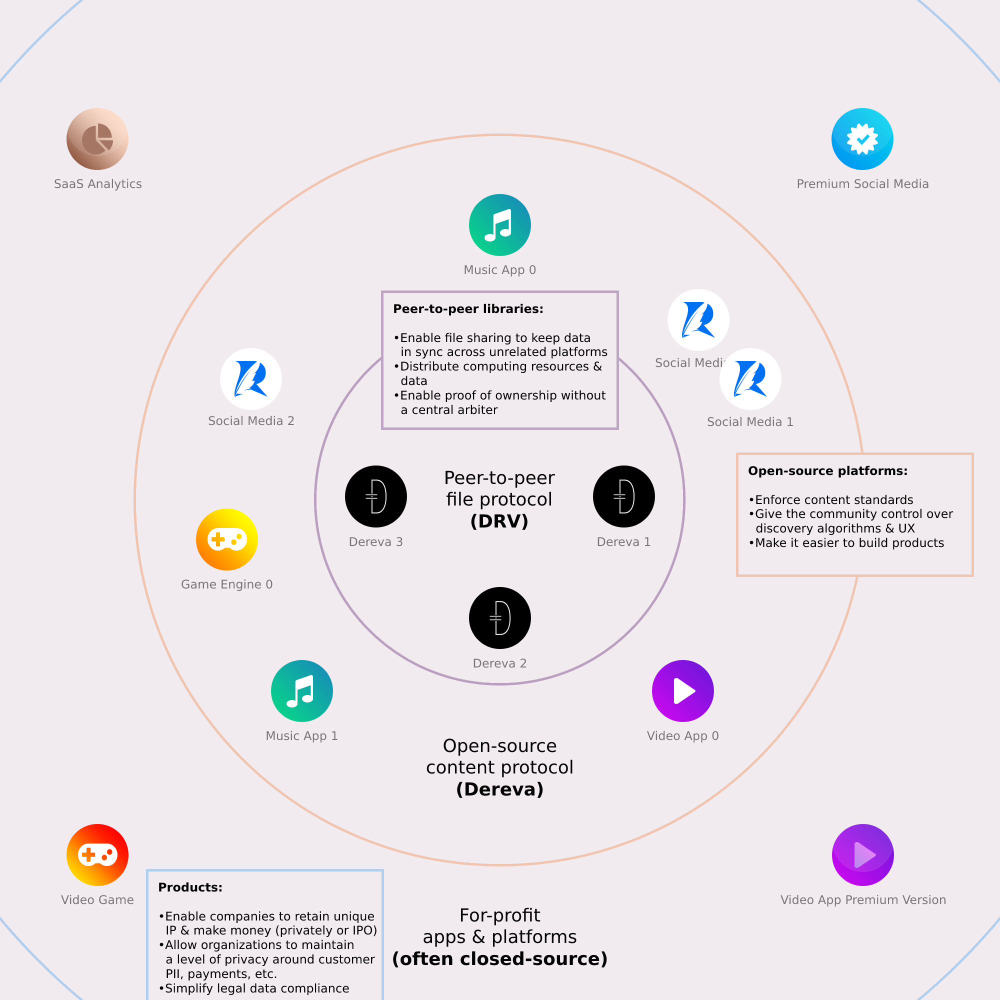

# Contributing

The easiest way to contribute is to:

- [Use it](https://reverse-social.vercel.app): Make it more popular
- Fork it: Host an instance of [Reverse](https://github.com/bennyschmidt/reverse) on some domain - this helps it become more decentralized
- Open PRs: Reverse hasn't reached feature-parity with Twitter yet (and might not need to)
  - The vision is something like [123movies](https://www.google.com/search?&q=123movies), where the experience across different instances of the site is mostly the same, but maybe some hosts will choose to show ads, while others might charge a fee - variations like that. Fundamentally, the [DRV](https://github.com/bennyschmidt/drv-core) library implements the peer-to-peer part - which keeps data across different deployed instances that have no communication with each other in sync - and through the [DRV200](https://github.com/bennyschmidt/drv200) standard, content types are enforced. In these "contracts" peer-to-peer file storage is directed (posts are not stored in a db, other than a temporary queue cache, so you can deploy this serverless with no file system), and ownership transfers are recorded (similar to Ethereum's ERC721, but without any fees or algorithmic "stake", just simple p2p filesharing).

