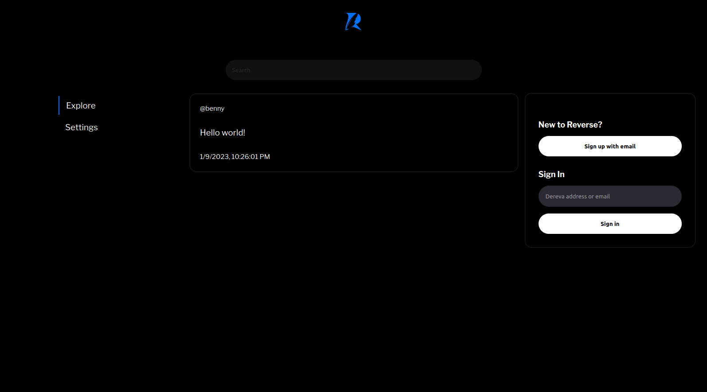
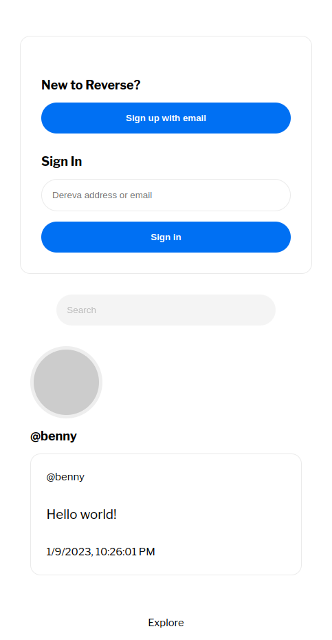

# Reverse Social Media

Deploy a decentralized Twitter-like community in minutes. 

# Contributing

Take a look at [Contributing.md](Contributing.md).

## Live Instances

- https://reverse-social.vercel.app (SSR, cloud/serverless)

## Screenshots

Reverse (desktop):



Reverse (mobile):



## Setup

See `.env.example`.

MongoDB is used to temporarily cache users and posts in the queue.

```
MONGO_URI=
DB_NAME=
```

Dereva is the underlying content blockchain where users and posts are retained in a peer-to-peer network.

```
DEREVA_API_KEY=
DEREVA_URI=
DEREVA_ADDRESS=
```

Nodemailer is used for email dispatch.

```
MAIL_HOST=
MAIL_NAME=
MAIL_PASS=
MAIL_SERVICE=
```

One-time passwords are used to authenticate creating users and posts.

```
OTP_EXPIRATION=
```

## Run the app

```
npm run dev
```

## Build & run

```
  npm run build
```

`npm start` to run the build

## Deploy

#### Vercel

You can very easily deploy this Next.js app on Vercel, this is the most plug-and-play option.

#### Elsewhere

You can also move the Vercel serverless API (the `pages/api/` directory) to its own Node application using [`node-service-core`](https://github.com/bennyschmidt/node-service-core), and deploy it to your favorite cloud platform, or run it on-prem. For the front-end, you can build the React app and deploy it static anywhere.

## Attribution  

Logo design of the letter R, a combination of a goose feather pen by [ruslyeffendi3120760](https://www.vecteezy.com/members/ruslyeffendi3120760) ([source](https://www.vecteezy.com/vector-art/4565911-the-initial-logo-design-of-the-letter-r-a-combination-of-a-goose-feather-pen-is-unique-and-attractive))

-----

# Next.js

This is a [Next.js](https://nextjs.org/) project bootstrapped with [`create-next-app`](https://github.com/vercel/next.js/tree/canary/packages/create-next-app).

## Getting Started

First, run the development server:

```bash
npm run dev
# or
yarn dev
```

Open [http://localhost:3000](http://localhost:3000) with your browser to see the result.

You can start editing the page by modifying `pages/index.js`. The page auto-updates as you edit the file.

[API routes](https://nextjs.org/docs/api-routes/introduction) can be accessed on [http://localhost:3000/api/hello](http://localhost:3000/api/hello). This endpoint can be edited in `pages/api/hello.js`.

The `pages/api` directory is mapped to `/api/*`. Files in this directory are treated as [API routes](https://nextjs.org/docs/api-routes/introduction) instead of React pages.

## Learn More

To learn more about Next.js, take a look at the following resources:

- [Next.js Documentation](https://nextjs.org/docs) - learn about Next.js features and API.
- [Learn Next.js](https://nextjs.org/learn) - an interactive Next.js tutorial.

You can check out [the Next.js GitHub repository](https://github.com/vercel/next.js/) - your feedback and contributions are welcome!

## Deploy on Vercel

The easiest way to deploy your Next.js app is to use the [Vercel Platform](https://vercel.com/new?utm_medium=default-template&filter=next.js&utm_source=create-next-app&utm_campaign=create-next-app-readme) from the creators of Next.js.

Check out our [Next.js deployment documentation](https://nextjs.org/docs/deployment) for more details.
